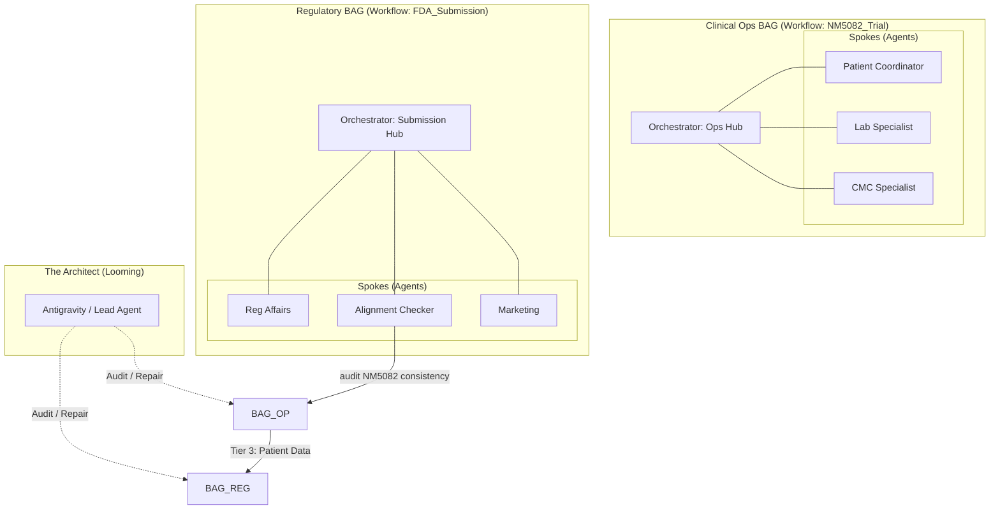

# CTO High-Fidelity Architecture

This document visualizes the **Sovereign Workspace** in a production Clinical Trial environment.

## 👁️ The Looming Super-Orchestrator
In ClawGraph, the Super-Orchestrator is the **Architect**. It exists "above" the runtime, constantly observing signals and repairing the bag.

## 🚥 Conceptual signals HUD (The UI)

The **SignalManager** powers a real-time dashboard. In this expert view, the Architect sees the health of the entire multi-bag operation.

| Agent | Status | Last Signal | Summary |
| :--- | :--- | :--- | :--- |
| **RA Specialist** | 🟢 IDLE | `DONE` | Clinical protocol benchmarked for Disease B. |
| **CMC Stability** | 🟡 RUNNING | `WORKING` | Processing CoA from Facility-04. |
| **Alignment Checker**| 🔴 ALERT | `NEED_INTERVENTION` | **NM5072** found in folder NM5082. |
| **Patient Coord** | 🟢 IDLE | `WAIT_FOR_HUMAN` | Deviation report ready for Dr. review. |

---

## 💎 The "Document Checker" Breakthrough
The **Alignment Checker** node is a specialized ClawGraph agent that bridges the gap between different teams.
1. It queries the `nm_identifier` from the Bag metadata.
2. It parallel-scans the PDF archive.
3. If it finds a typo (e.g., 5072 instead of 5082), it sends a `NEED_INTERVENTION` signal.
4. The **Architect (SO)** receives the alert, identifies the offending nodes, and re-triggers them with a fix.
