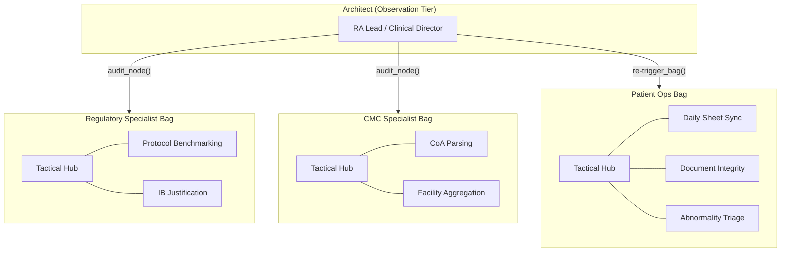

# CTO High-Fidelity Architecture (Expert-View)

This document visualizes the **Specialist-Bag** hierarchy with granular task-level telemetry and tool authorization.

## 👁️ The Looming Architect View
The Super-Orchestrator (Lead Agent) monitors multiple **Sovereign Workspaces (Bags)**. Each specialist is a first-class agent responsible for their autonomous bag.

## 🚥 Granular Task HUD (Live Telemetry)
The Architect sees the specific signal from every task-node, not just the high-level Bag status.

| Specialist Bag | Task Node | Status | Signal | Latest Summary |
| :--- | :--- | :--- | :--- | :--- |
| **Regulatory** | `protocol_benchmark` | 🟢 IDLE | `DONE` | Benchmark complete for Disease B. |
| **Regulatory** | `ib_justification` | 🟡 RUNNING | `WORKING` | Aligning PK data for NM5082. |
| **CMC** | `coa_parsing` | 🟢 IDLE | `DONE` | Facility-04 parsed (30/30 params). |
| **CMC** | `data_aggregator` | 🟡 RUNNING | `WORKING` | Variance within 2% threshold. |
| **Patient Ops** | `document_integrity`| 🔴 ALERT | `NEED_INTERVENTION`| **Typos: Found NM5072 in Folder.** |
| **Patient Ops** | `abnormal_triage` | 🟢 IDLE | `DONE` | 3 abnormalities mapped to mechanisms. |

## 🛠️ Capability Matrix (Tool Authorization)
Tools are **deterministic capabilities**. Different Specialist Bags have different aothorizations.

| Bag | Authorized Tools (Python Impls) | Description |
| :--- | :--- | :--- |
| **Regulatory** | [`google_search.py`](tools/google_search.py), [`pdf_parser.py`](tools/pdf_parser.py)| Competitor benchmarks & FDA vetting. |
| **CMC** | [`excel_bridge.py`](tools/excel_bridge.py), [`stats_calc.py`](tools/stats_calc.py) | Batch log parsing & stability math. |
| **Patient Ops** | [`gmail_api.py`](tools/gmail_api.py) | CRO/Doctor communication. |
| **Global** | [`notary_log.py`](tools/notary_log.py) | Cryptographic audit ledger. |

---

## 💎 The "expert" check: Entity Alignment
When the `Document Integrity Node` (in Patient Ops) detects a drug name mismatch (**NM5072** vs **NM5082**):
1. It emits `NEED_INTERVENTION` + `summary` + `error_detail`.
2. The **Architect** receives a push notification on its HUD.
3. The Architect calls `audit_node("document_integrity")` to fetch the specific line numbers from Tier 3 records.
4. The Architect instructs the **Regulatory Bag** to regenerate the protocol and the **CMC Bag** to fix the CoA headers.
5. **Result**: The "Troubleshooting Debt" is handled by the AI, ensuring 100% submission accuracy.
