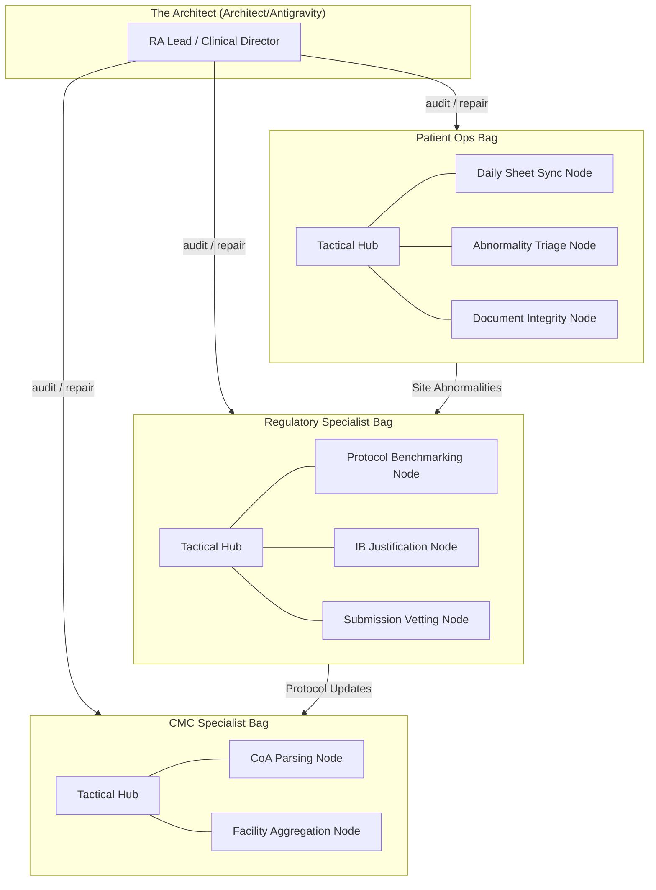

# CTO High-Fidelity Architecture (Refined)

This document visualizes the **Specialist-Bag** architecture of ClawGraph.

## 👁️ The Specialist Tier
In this model, each clinical specialist group operates within its own **Sovereign Workspace (Bag)**. The Architect (Super-Orchestrator) coordinates across these specialist boundaries.

## 🚥 Specialist HUD View

| Bag | Specialist | Health | Last Major Signal | Task in Progress |
| :--- | :--- | :--- | :--- | :--- |
| **Regulatory** | RA Specialist | 🟢 OK | `DONE` | IB Justification |
| **CMC** | CMC Specialist | 🟡 RUNNING | `WORKING` | CoA Aggregation |
| **Patient Ops** | Clinical Coord| 🔴 ALERT | `NEED_INTERVENTION`| **Document Alignment** |

---

## 🛠️ Task-Level Atomic Skills
Each node in a bag is mapped to a highly specific skill file. For example, in the **Patient Ops Bag**, the `Document Integrity Node` uses:
- **Skill**: [`document_checker.md`](skills/patient_ops/document_checker.md)
- **Goal**: Specifically catch drug identifier mismatches (NM5072 vs NM5082).

This separation ensures that if the FDA changes a vetting rule, the Architect only needs to swap out one `.md` skill file in the **Regulatory Bag**, leaving the rest of the clinical system untouched.
