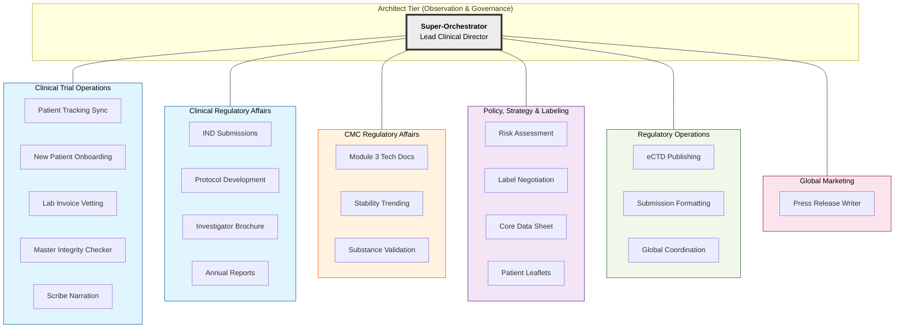

# Clinical Trial Operations & Regulatory Affairs (CTO/RA) Framework

This high-fidelity example demonstrates **ClawGraph** applied to highly regulated, error-intolerant pharmaceutical workflows. The system utilizes a **Sovereign Multi-Bag Architecture** to coordinate between Global Regulatory Strategy, Chemistry Manufacturing & Controls (CMC), and Clinical Trial Operations.

---

## 🏛️ System Architecture: The "Director's HUD"

The architecture is centered around a **Super-Orchestrator (SO)**—the Clinical Director agent—which maintains global state and mediates all cross-domain communication. Domain expertise is compartmentalized into **Sovereign Domains**, each containing a suite of specialized Task Nodes.

---

## 🚥 Orchestration Logic: Domain Sovereignty

ClawGraph enforces **Domain Decoupling**. Task nodes within a domain (e.g., CMC) are unaware of the internal structure of other domains (e.g., Regulatory). All cross-domain coordination is mediated by the **Super-Orchestrator** using standardized signals.

### 1. Signal-Mediated Delegation
Nodes do not trigger each other across domains. Instead, they emit tactical signals:
*   **`DONE`**: Action complete; state updated.
*   **`FAILED`**: Critical error detected; SO must re-route or halt.
*   **`NEED_INTERVENTION`**: Non-blocking issue found requiring SO/Human review.
*   **`HOLD_FOR_HUMAN`**: High-stakes decision (e.g., Safety Updates) pending Lead sign-off.

### 2. Predictive Orchestration (Next-Step Hints)
To reduce the cognitive load of the Super-Orchestrator, nodes provide **Hints**—predictive recommendations for the next logical delegation based on internal domain expertise.
*   **CMC Stability Node**: *"Impurity drift detected. Hint: `check:regulatory_safety_update`."*
*   **SO Logic**: Receives hint -> Evaluates Global Strategy -> Delegates to **Clinical Regulatory**.

---

## 💎 High-Fidelity "Expert" Logic Benchmarks

This example addresses specific, high-risk scenarios encountered in Clinical Trial management:

### The "NM-Class" Identity Trap
A common failure in global dossiers is the persistence of old drug identifiers (e.g., **NM5072**) in a new submission (e.g., **NM5082**) due to text recycling. 
- The `integrity_checker` Node (Clinical Ops) performs cross-dossier entity alignment.
- Mismatches trigger a `NEED_INTERVENTION` signal to the **SO**, which then orchestrates corrective actions across the Reg and CMC domains simultaneously.

### Automated Financial Vetting (Invoice vs. Protocol)
To prevent operational over-billing, the `lab_invoice_vetting` Node (Clinical Ops) compares incoming lab bills against the **Schedule of Assessments (SoA)** defined in the `protocol_development` domain. Deviations are flagged automatically for the Architect.

### Regulatory Threshold Monitoring
CMC teams must monitor stability data against shifting global thresholds (e.g., impurity standards dropping from 0.5% to 0.1%). The `stability_manager` Node monitors these trends and proactively recommends dossier updates if thresholds are breached.

### Regulatory Threshold Monitoring
CMC teams must monitor stability data against shifting global thresholds (e.g., impurity standards dropping from 0.5% to 0.1%). The `stability_manager` Node monitors these trends and proactively recommends dossier updates if thresholds are breached.

---

## 🛠️ Implementation Reference

*   **[nodes.py](nodes.py)**: The code-level implementation of the 22+ nodes.
*   **[skills/](skills/)**: The library of expert markdown-based instructions for each specialist.
*   **[tools/](tools/)**: Python-based mock implementations of capability APIs (PDF Parsing, Stats Calculation, etc.).
