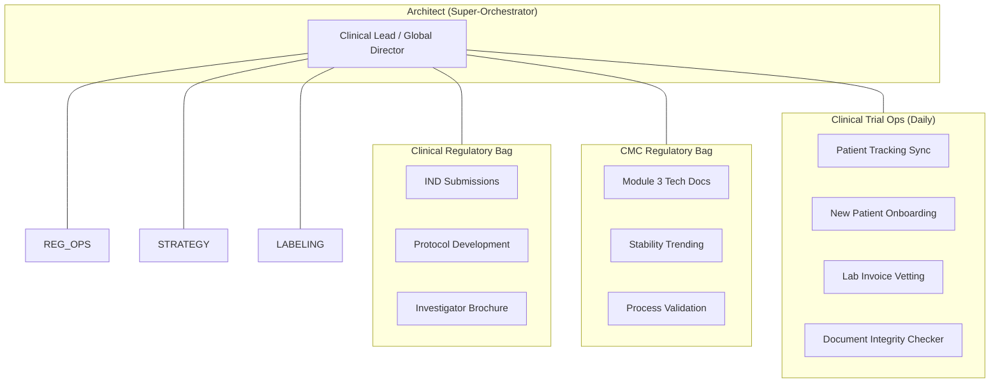

# CTO High-Fidelity README (Expert-View)

This document visualizes the **Specialist-Bag** hierarchy with granular task-level telemetry and tool authorization.

## 👁️ The Looming Architect View
The Super-Orchestrator manages a **6-Bag Sovereign Architecture**, coordinating between regulatory strategy, technical CMC data, and granular clinical operations.

## 🚥 Cross-Bag Interrelationships (Super-Orchestrator Logic)
ClawGraph excels at the "Feedback Loops" that humans often miss:

1.  **Technical Pulse -> Clinical Update**: If `STAB` (CMC Bag) reports impurity drift, the **Architect** re-triggers `IND` (Clinical Reg) to update the safety justification.
2.  **Ops Feedback -> Protocol Change**: If `INT` (Clinical Ops) finds that Site Doctors can't fill the narration form in time, the **Architect** alerts `PROT` (Clinical Reg) to amend the protocol.
3.  **Entity Alignment**: If a patient data change occurs, the Architect signals **all** bags to run their `Document Integrity` nodes to ensure NM-class IDs match (e.g., catching **NM5072** vs **NM5082**).

## 🛠️ Capability Matrix (Refined)
| Bag | Skill Scope | Authorized Tools |
| :--- | :--- | :--- |
| **Clinical Reg** | IND, Protocols, IB | `pdf_parser.py`, `notary_log.py` |
| **CMC Reg** | Module 3, Stability | `excel_bridge.py`, `stats_calc.py` |
| **Clinical Ops** | Daily Sync, Lab Vetting | `gmail_api.py`, `google_search.py` |
| **Reg Ops** | eCTD, Formatting | `pdf_parser.py` |

---

## 💎 The "expert" check: Entity Alignment
When the `Document Integrity Node` (in Patient Ops) detects a drug name mismatch (**NM5072** vs **NM5082**):
1. It emits `NEED_INTERVENTION` + `summary` + `error_detail`.
2. The **Architect** receives a push notification on its HUD.
3. The Architect calls `audit_node("document_integrity")` to fetch the specific line numbers from Tier 3 records.
4. The Architect instructs the **Regulatory Bag** to regenerate the protocol and the **CMC Bag** to fix the CoA headers.
5. **Result**: The "Troubleshooting Debt" is handled by the AI, ensuring 100% submission accuracy.
