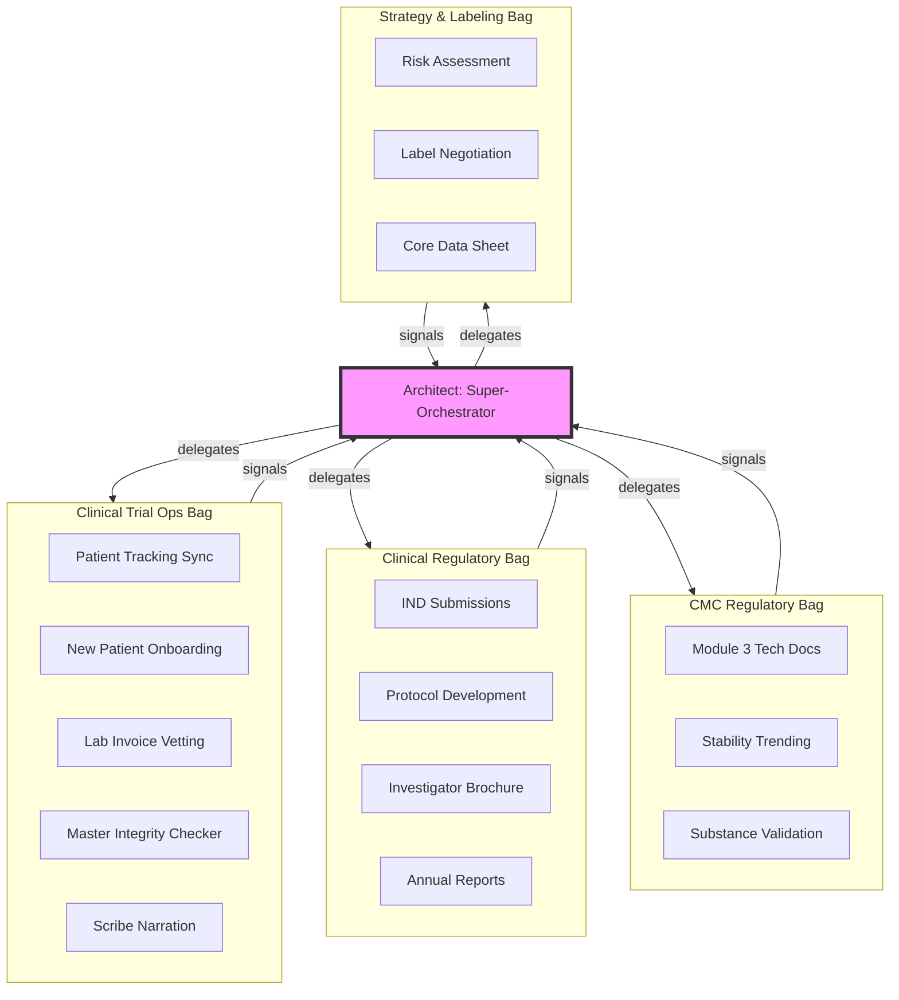

# CTO High-Fidelity README (Expert-View)

This document visualizes the **Specialist-Bag** hierarchy with granular task-level telemetry and tool authorization.

## 👁️ The Looming Architect View
The Super-Orchestrator manages a **6-Bag Sovereign Architecture**, coordinating between regulatory strategy, technical CMC data, and granular clinical operations.

## 👁️ The Looming Architect View
The Super-Orchestrator manages a **6-Bag Sovereign Architecture**. Every box below represents a 1st-class Agent Node.

## 👁️ The Looming Architect View
The Super-Orchestrator (SO) is the central hub. It delegates between **Sovereign Bags** based on their tactical signals. There are **no explicit connections** between nodes across different bags.

## 🚥 Cross-Bag Delegation (SO-Mediated Logic)
ClawGraph preserves bag sovereignty. Communication is always mediated by the Super-Orchestrator:

1.  **Technical Event -> Tactical Re-route**: If `STAB` (CMC Bag) emits a `FAILED` signal with a stability drift detail, the **Architect** (SO) reasons that the `IND` (Clinical Reg) needs an update. 
2.  **Ops Signal -> Strategic Alert**: If `INT` (Clinical Ops) detects an NM-ID mismatch, it signals `NEED_INTERVENTION`. The **Architect** then pauses the `PUBL` (Reg Ops) workflow and tasks the `PROT` bag with a correction.
3.  **Sovereignty Rule**: A node in the CMC Bag *cannot* trigger a node in the Regulatory Bag. It can only report its finding to the SO, which then decides the next delegation.

## 🛠️ Predictive Signaling (Intents for the SO)
Nodes emit `next_steps_hint` as **recommendations** for the Architect, not as direct commands.
*   **CMC Node**: "Stability failed. Hint: `trigger:ind_safety_update`."
*   **SO Logic**: Receives hint -> Validates against Global Strategy -> Delegates to `clinical_regulatory` Bag.

---

## 💎 The "expert" check: Entity Alignment
When the `Document Integrity Node` (in Patient Ops) detects a drug name mismatch (**NM5072** vs **NM5082**):
1. It emits `NEED_INTERVENTION` + `summary` + `error_detail`.
2. The **Architect** receives a push notification on its HUD.
3. The Architect calls `audit_node("document_integrity")` to fetch the specific line numbers from Tier 3 records.
4. The Architect instructs the **Regulatory Bag** to regenerate the protocol and the **CMC Bag** to fix the CoA headers.
5. **Result**: The "Troubleshooting Debt" is handled by the AI, ensuring 100% submission accuracy.
