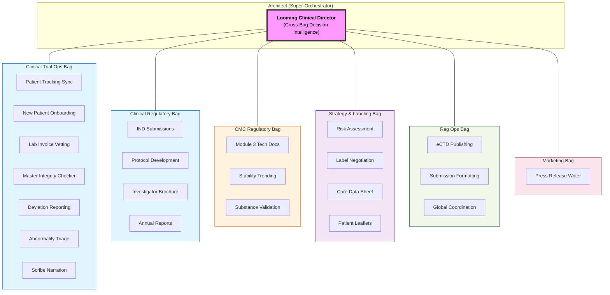

# CTO High-Fidelity README (Expert-View)

This document visualizes the **Specialist-Bag** hierarchy with granular task-level telemetry and tool authorization.

## 👁️ The Looming Architect View
The Super-Orchestrator manages a **6-Bag Sovereign Architecture**, coordinating between regulatory strategy, technical CMC data, and granular clinical operations.

## 👁️ The Looming Architect View
The Super-Orchestrator manages a **6-Bag Sovereign Architecture**. Every box below represents a 1st-class Agent Node.

## 👁️ The Looming Architect HUD
The Super-Orchestrator manages a **6-Bag Sovereign Architecture**. Every element below is a 1st-class Agent Node or Domain-Specific Skill, coordinated via a single tactical hub.

## 🚥 Cross-Bag Delegation (SO-Mediated Logic)
ClawGraph preserves bag sovereignty. Communication is always mediated by the Super-Orchestrator (SO):

1.  **Technical Pulse -> Clinical Update**: If `STAB` (CMC Bag) emits structural drift data, the **SO** re-triggers the `IND` (Clinical Reg) node to update the safety justification.
2.  **Ops Signal -> Strategic Alert**: If `INT` (Clinical Ops) detects an NM-ID mismatch (NM5072 vs NM5082), the **SO** pauses the `PUBL` (Reg Ops) workflow and tasks the `PROT` (Clinical Reg) bag with a correction.
3.  **Sovereignty Rule**: A node in one bag cannot see or trigger a node in another. It reports to the **Architect**, which maintains the global "State of the Submission."

## 🛠️ Predictive Signaling (Hints for the SO)
Nodes emit `next_steps_hint` as tactical recommendations.
*   **Medical Scribe**: "Visit complete. Hint: `check:daily_sync`."
*   **Stability Agent**: "New impurity threshold met. Hint: `check:mfg_comparability`."
*   **SO Logic**: Receives hints -> Filters through Global Strategy -> Delegates to the next Sovereign Bag.

---

## 💎 The "expert" check: Entity Alignment
When the `Document Integrity Node` (in Patient Ops) detects a drug name mismatch (**NM5072** vs **NM5082**):
1. It emits `NEED_INTERVENTION` + `summary` + `error_detail`.
2. The **Architect** receives a push notification on its HUD.
3. The Architect calls `audit_node("document_integrity")` to fetch the specific line numbers from Tier 3 records.
4. The Architect instructs the **Regulatory Bag** to regenerate the protocol and the **CMC Bag** to fix the CoA headers.
5. **Result**: The "Troubleshooting Debt" is handled by the AI, ensuring 100% submission accuracy.
