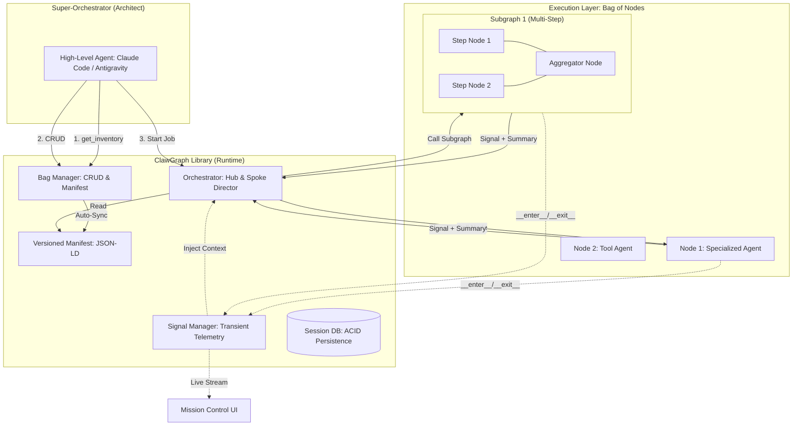
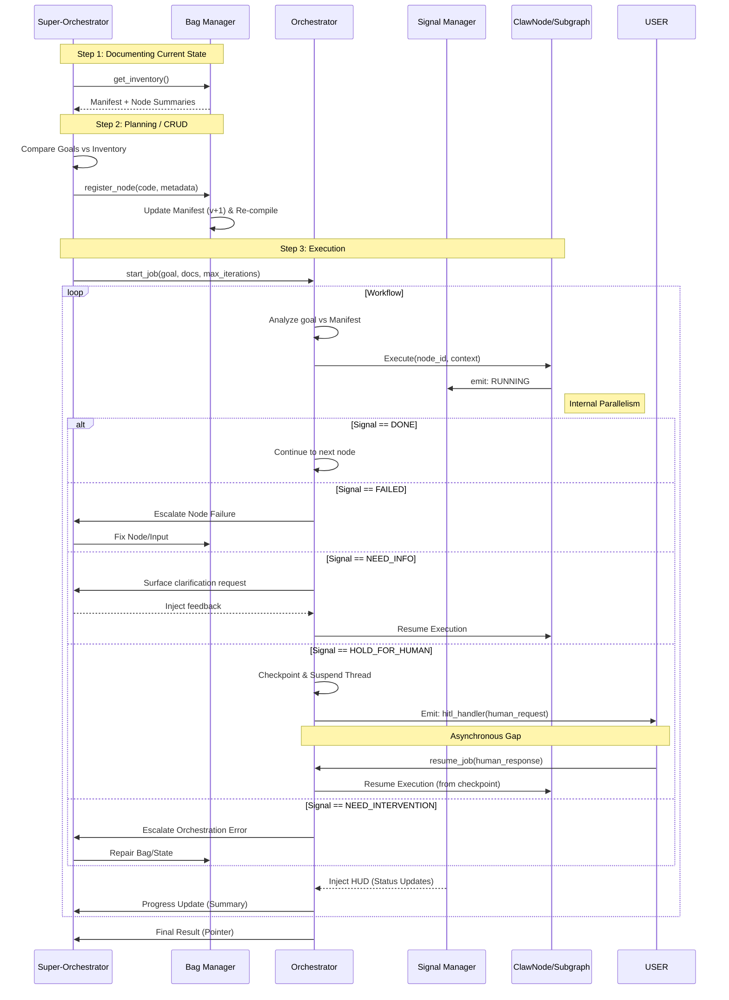
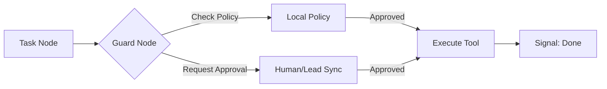

# Architecture Specifications: ClawGraph

## 1. System Overview
ClawGraph is architected as a hierarchical multi-agent orchestration framework. It separates the **concierge/strategic decisions** from the **tactical execution** by introducing a three-layer hierarchy: Super-Orchestrator, Orchestrator, and a dynamic Bag of Nodes.

### 1.1 The Sovereign Workspace Model
To simplify the mental model for developers, ClawGraph operates on a **Coder-Runtime-Library** analogy:
- **Super-Orchestrator = The Coder**: The intelligent actor that writes, modifies, and debugs the code (nodes).
- **Orchestrator = The Runtime**: The engine that executes the code and manages the signals.
- **Bag of Nodes = The Library**: The collection of addressable functions and capabilities available to the workspace.

> [!IMPORTANT]
> **Scale Constraint**: Orchestrator reasoning quality degrades as the manifest grows. The recommended hard limit is **~50 nodes** per bag. When a workflow exceeds this, the Super-Orchestrator should split it into multiple independent bags (Hierarchical Orchestration).

## 2. Component Diagram
The following diagram illustrates the relationship between the primary components of the ClawGraph ecosystem.

### 2.1 The Bag (Node Layer)
The "Bag" is a set of **Agent Nodes**. Each node is a discrete unit of execution with:
- **Core Logic**: The Python implementation.
- **Agent Persona**: Defined by `description` and `skills.md`.
- **Hardware/Model Specs**: Specific `provider` and `model` preferences.
- **Sandboxed Tools**: A list of authorized capabilities (CLI, API).

## 3. The "Bag of Nodes" Design
The "Bag" is a dynamic registry of `ClawNode` and `ClawSubgraph` objects. Unlike traditional LangGraph implementations, these nodes are not statically linked by edges at compile time. Instead, they are **individually addressable**.

### Key Components:
- **ClawNode**: A python decorator/wrapper around LangGraph nodes. It performs three critical roles:
    1. **Schema Enforcement**: Ensures output contains `signal` and `summary`.
    2. **Instrumentation**: Emits life-cycle events (`RUNNING`, `DONE`) to the `SignalManager`.
    3. **Pointer Wrapping**: Automatically wraps raw node outputs into `uri` pointers to keep the global state minimal.
- **ClawBag**: A container that manages node registration, the "Bag Contract" (Input/Output schemas), and re-compilation.
- **Signal Manager**: An independent, **transient** telemetry module. It tracks "what is happening right now." 
    - *State Tension Resolution*: On crash/resume, the Signal Manager state is reset (nodes marked as `STALE`). The Orchestrator relies on the **Session DB** and LangGraph Checkpointer for history, using the Signal Manager only for the live HUD and current turn context.

## 4. Sequence Flow: Job Execution
This flow demonstrates the "Hub-and-Spoke" model where the Orchestrator (Hub) manages the execution of individual nodes (Spokes).

## 5. Data Flow & State Management
ClawGraph uses a **Pointer-Based State** to maintain a 500k+ token context window efficiency.

| State Key | Type | Description |
| :--- | :--- | :--- |
| `objective` | string | The high-level goal provided by the Super-Orchestrator. |
| `bag_contract` | schema | Defined input/output constraints for this bag. |
| `bag_manifest` | uri | Pointer to the current JSON-LD manifest (versioned). |
| `document_archive` | map[id, uri] | Registry of document pointers (results of node execution). |
| `phase_history` | list[summary] | Sequential list of accomplishment summaries for grounding. |

---

## 6. Hybrid Routing & Execution
ClawGraph supports two modes of execution within the same bag:
1. **Hub-and-Spoke (Discretionary)**: The Orchestrator routes between independent nodes or subgraphs based on the current mission state.
2. **Explicit Edges (Deterministic)**: Tightly coupled, deterministic node pairs (e.g., A → B) are implemented as subgraphs with explicit LangGraph edges, hiding internal complexity from the Orchestrator.

## 7. Security Architecture (Guardrails)
Every dangerous tool call (shell, filesystem) is wrapped in a `GuardNode` that intercepts the execution.

### 7.1 TEE & Attestation (Strategic Roadmap)
Future iterations of ClawGraph will support execution within **Trusted Execution Environments (TEEs)** (e.g., AWS Nitro Enclaves, Intel SGX).
- **Cryptographic Attestation**: GuardNodes will surface attestation reports to the Super-Orchestrator to prove that the code being executed hasn't been tampered with and that security policies were enforced in a secure enclave.
- **Kernel Isolation**: Integration with **gVisor** or **Kata Containers** for hardware-level isolation of untrusted node code.

## 8. Implementation Considerations
- **Dynamic Compilation**: Use the `ServerRuntime` or a custom factory pattern to rebuild the `StateGraph` when a `ClawBag` is modified.
    - **Lazy Compilation**: The BagManager must only re-compile the graph if the manifest version has changed since the last execution to prevent "thought lag."
- **Pydantic Schemas**: Force all `ClawNode` outputs to inherit from a base `ClawOutput` containing `signal: str` and `summary: str`.
- **Checkpointing & Storage**: 
    - Utilize LangGraph's native checkpointers (e.g., `SqliteSaver`, `PostgresSaver`) for durable state.
    - **SQLite** is the recommended default for localized/development environments.
    - **Postgres** is recommended for production multi-user or high-concurrency environments.

### 8.1 HITL Delivery Mechanism
ClawGraph decouples signaling from delivery.
- **The Interface**: The `ClawBag` exposes a `register_hitl_handler(callback)` method.
- **The Execution**: When a node signals `HOLD_FOR_HUMAN`, the Orchestrator executes the callback with the `thread_id` and `human_request`.
- **The Suspension**: The library does **not** block a thread while waiting. It persists the state and marks the job as `SUSPENDED` in the Session DB, allowing the compute to be freed.
- **The Resumption**: The `resume_job(thread_id, response)` method pulls the checkpointed state, injects the response, and continues execution (re-compiling only if the manifest version changed during suspension).

## 9. Development Workflows

### 9.1 Discovery-First Enforcement
To prevent the Super-Orchestrator from "leaping" to redundant conclusions, the library implements a multi-layered **advisory** guardrail pattern:
1.  **Skill Instruction**: Super-Orchestrator skills (tool definitions) are explicitly instructed to call `get_inventory()` as the first action of any planning phase.
2.  **Property Visibility**: The `ClawBag` class exposes a `have_you_queried_bag_inventory: bool` property (default `False`). 
3.  **Docstring Enforcement**: The class docstring instructs Super-Orchestrators to query inventory before CRUD. Because the Super-Orchestrator reads the class definition to generate calling code, this serves as a proactive reminder.
4.  **Runtime Warning**: As a secondary fallback, CRUD operations (`register_node`, `update_node`, `delete_node`) will emit a **non-blocking warning** if `have_you_queried_bag_inventory` is False.
- A flag (e.g., `--force` or `ignore_inventory_check=True`) is provided to bypass this for scripted automation and tests.

### 9.2 Cold-Start (Building from Scratch)
For new projects, the library provides a canonical "Cold-Start" flow:
1.  **Initialize Bag**: `bag = ClawBag(name="project_x", contract=my_schema)`
2.  **Define Core Nodes**: Super-Orchestrator generates initial specialized nodes.
3.  **Bootstrap Manifest**: Sequential `register_node` calls to populate the bag.
4.  **First Run**: `start_job` to test the initial wiring.

## 10. Signal Manager & Instrumentation
The `SignalManager` provides a "Heads-Up Display" (HUD) for the system.

### Principles:
- **Instrumentation vs. Logic**: Signaling is handled by the `ClawNode` wrapper. Target nodes remain "ignorant" of the telemetry layer.
- **Independence**: Signal state is transient and lives outside the durable checkpointer.
- **Consumption**:
    - **UI**: Renders a node-based dashboard showing running/completed nodes and their summaries.
    - **Orchestrator**: Receives a status snapshot as ambient context at the start of each reasoning turn.

### 10.1 Progressive Disclosure & 3-Tier Node Architecture
To maintain efficiency, ClawGraph implements a **3-Tier** disclosure model for node data:

1.  **Tier 1: Metadata (Manifest)**: Name, tags, and a **Super-Orchestrator-written description**. This is always resident in the Orchestrator's context. The Orchestrator operates *only* at Tier 1.
2.  **Tier 2: Instructions (Internal)**: The node's specific instructions (prompts) and internal code. This is loaded **only** when requested by the Super-Orchestrator for auditing or editing.
3.  **Tier 3: Resources (Archive)**: Raw tool outputs and artifacts stored as URI pointers. Retrieved on-demand via `audit_node()`.

#### Audit Triggers
Transitions from Tier 1 to Tier 3 are driven by two mechanisms:
- **`audit_hint`**: A signal from the node (worker) indicating that its particular output warrants inspection.
- **`audit_policy`**: A metadata rule defined by the Architect (Super-Orchestrator) during node registration that mandates auditing under specific conditions (e.g., always audit code-gen nodes).

- **User Oversight**: If a human user or the Super-Orchestrator needs to inspect raw data, the Super-Orchestrator is the actor responsible for fetching it; Tier 2 and Tier 3 data are never automatically injected into the Orchestrator's reasoning context.
- **Level 4 (Audit Isolation)**: Audit data remains isolated from the Orchestrator's standard reasoning loop to prevent context bloat.

## 11. Rollback & State Anchors (Experimental)
ClawGraph maintains a `manifest_history`. The `rollback_bag(version)` command:
1.  Reverts the `JSON-LD` manifest to the targeted version.
2.  Triggers a re-compilation of the `StateGraph`.
3.  Clears any transient `SignalManager` state.
*Note: Rollback does not automatically delete results in the Document Archive, but may make their pointers inaccessible to current nodes.*
