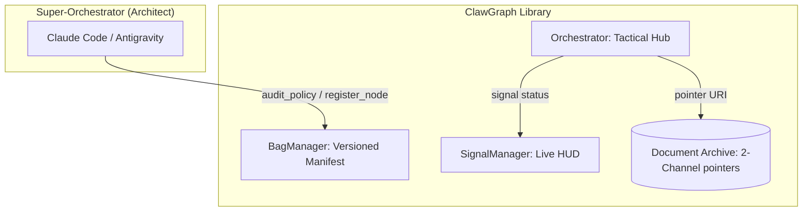

# ClawGraph Documentation Walkthrough

We have finalized a comprehensive suite of specifications and design patterns for **ClawGraph**, a hierarchical agent orchestration framework. The documentation is now production-ready, covering everything from business objectives to low-level JSON-LD schemas.

## 📄 Documentation Suite Overview

The following core documents have been organized in the `notes/` directory:

- [02_BRS.md](file:///Users/aaronrodrigues/projects/clawgraph/notes/02_BRS.md): Executive summary, business objectives, and success metrics.
- [03_FRS.md](file:///Users/aaronrodrigues/projects/clawgraph/notes/03_FRS.md): Detailed functional requirements, API list, and signal definitions.
- [05_ARCHITECTURE.md](file:///Users/aaronrodrigues/projects/clawgraph/notes/05_ARCHITECTURE.md): Technical architecture, components, and security guardrails.
- [04_requirements.md](file:///Users/aaronrodrigues/projects/clawgraph/notes/04_requirements.md): High-level system philosophy and scale constraints.
- [06_patterns.md](file:///Users/aaronrodrigues/projects/clawgraph/notes/06_patterns.md): Canonical node patterns, Super-Orchestrator skills, and HUD schemas.
- [07_use_cases.md](file:///Users/aaronrodrigues/projects/clawgraph/notes/07_use_cases.md): Real-world application scenarios.
- [09_library_structure.md](file:///Users/aaronrodrigues/projects/clawgraph/notes/09_library_structure.md): Proposed directory and module structure.

---

## 🚀 Core Concepts & Final Refinements

### 1. The Sovereign Workspace Model
We've aligned the architecture around a clear **Coder-Runtime-Library** analogy:
- **Super-Orchestrator (The Coder)**: Intelligent architect (e.g., Claude Code) that builds and debugs the bag.
- **Orchestrator (The Runtime)**: Tactical director that manages signals and routing.
- **Bag of Nodes (The Library)**: Dynamic collection of task-specific capabilities.

### 2. 3-Tier Node Architecture & Progressive Disclosure
To maintain token efficiency, nodes expose data in three tiers:
| Tier | Content | Accessibility |
|---|---|---|
| **Tier 1 (Metadata)** | Name, Description, Tags | Always resident in Orchestrator context. |
| **Tier 2 (Instructions)** | Prompts, Logic, Node Code | On-demand for Super-Orchestrator audit/edit. |
| **Tier 3 (Resources)** | Raw Outputs, Large Artifacts | Pointer-based; only loaded via `audit_node()`. |

### 3. Audit Governance (Hinting vs. Policy)
Decision-making regarding audits is partitioned between workers and architects:
- **`audit_hint` (Worker-led)**: A node signaling high-stakes or subtle failure risk.
- **`audit_policy` (Architect-led)**: Metadata-driven rules (e.g., "Always audit code generation") enforced by the Super-Orchestrator.

### 4. Mission Control & Implicit Data Flow
The system now supports a real-time HUD through `get_hud_snapshot()`. 
- **Topology Links**: Explicit structural edges from the underlying LangGraph.
- **Data Flow Links**: Implicit relationships inferred by the library when one node consumes a URI produced by another.

### 5. Scale & Operational Stability
- **Hard Limit**: Recommended ~50 nodes per bag to preserve reasoning quality.
- **Lazy Compilation**: Compiles the execution graph only when the manifest version changes, preventing "thought lag."
- **Aggregator Granularity**: Parallel subgraphs must identify specific failed branches by name in `error_detail`.

---

## 🎨 Visualizing the Logic

This concludes the documentation phase. The design is now sufficiently specified for full implementation.

---

## 🛠️ Implementation Roadmap

The project will move forward in five distinct phases:

### Phase 1: Foundation & State (The Bag)
- **Goal**: Establish the core data structures and state management.
- **Key Deliverables**: `SignalManager`, `BagManager`, and Pydantic schemas for `ClawOutput`.
- **References**: [05_ARCHITECTURE.md](file:///Users/aaronrodrigues/projects/clawgraph/notes/05_ARCHITECTURE.md#L160-L170), [03_FRS.md](file:///Users/aaronrodrigues/projects/clawgraph/notes/03_FRS.md#L45-L55).

### Phase 2: Tactical Hub (The Orchestrator)
- **Goal**: Implement the hub-and-spoke routing logic using LangGraph.
- **Key Deliverables**: Dynamic graph compilation, Orchestrator system prompt, and signal-based routing.
- **References**: [05_ARCHITECTURE.md](file:///Users/aaronrodrigues/projects/clawgraph/notes/05_ARCHITECTURE.md#L50-L75), [06_patterns.md](file:///Users/aaronrodrigues/projects/clawgraph/notes/06_patterns.md#L20-L40).

### Phase 3: The Architect's Tools (Super-Orchestrator Skills)
- **Goal**: Enable the "Lead Teammate" to manage and repair the bag.
- **Key Deliverables**: `register_node`, `update_node`, `get_inventory`, and Discovery-First protocol.
- **References**: [06_patterns.md](file:///Users/aaronrodrigues/projects/clawgraph/notes/06_patterns.md#L210-L240), [03_FRS.md](file:///Users/aaronrodrigues/projects/clawgraph/notes/03_FRS.md#L31-L37).

### Phase 4: HUD & Telemetry (Observability)
- **Goal**: Build the "Mission Control" visibility layer.
- **Key Deliverables**: `get_hud_snapshot` API and implicit data-flow graph generation.
- **References**: [06_patterns.md](file:///Users/aaronrodrigues/projects/clawgraph/notes/06_patterns.md#L365-L395), [03_FRS.md](file:///Users/aaronrodrigues/projects/clawgraph/notes/03_FRS.md#L61-L64).

### Phase 5: Production & Hardening
- **Goal**: Finalize security, persistence, and specialized deployment patterns.
- **Key Deliverables**: SQLite/Postgres persistence, Heartbeat/Cron pattern, and ACID state validation.
- **References**: [05_ARCHITECTURE.md](file:///Users/aaronrodrigues/projects/clawgraph/notes/05_ARCHITECTURE.md#L165-L178), [06_patterns.md](file:///Users/aaronrodrigues/projects/clawgraph/notes/06_patterns.md#L335-L360).
