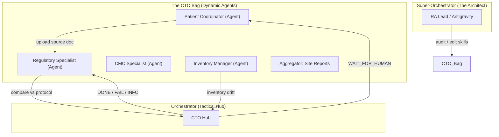

# Case Study: Clinical Trial Operations & Regulatory Affairs

This use case demonstrates how **ClawGraph** manages the extreme complexity of Clinical Trial Operations (CTO) and Regulatory Affairs (RA). It showcases the "Sovereign Workspace" in a high-stakes, multi-specialist environment where zero errors are tolerated.

## 📁 The "Clinical Pipeline" Bag Architecture



---

## 🎭 Agent Profiles & Skill Definitions

Each node in the CTO Bag is a full Agent with dedicated skills and LLM optimization.

### 1. The Regulatory Specialist (RS)
- **Role**: Competitive analysis, protocol benchmarking, and FDA submission vetting.
- **LLM**: Claude 3.5 Sonnet (Optimized for nuanced logic & compliance).
- **Skills**: [`benchmarking.md`](#), [`fda_21cfr.md`](#).
- **Workflow**:
    - When a new drug indication (Disease B) is identified, RS benchmarks it against the successful protocol of Disease A.
    - Automates the "Investigation of Brochure" (IB) updates, justifying why mechanism A applies to disease B.

### 2. The CMC Specialist (Stability & Maintenance)
- **Role**: Monitors drug stability (0% error tolerance).
- **Logic**: 
    - Receives Certificate of Analysis (CoA) from manufacturers.
    - Aggregates multi-facility data points (averaging vs. picking best-case).
    - **Trigger**: If impurity standards change from 0.5 to 0.1, CMC triggers a `NEED_INTERVENTION` to the Architect to update manufacturing parameters.
- **Skills**: [`stability_testing.md`](#), [`coa_parser.py`](#).

### 3. The Patient Coordinator (PC)
- **Role**: Daily communication between CROs, Labs, and Doctors.
- **Workflow**:
    - Manages the "Daily Update Sheet" (Excel) across time zones.
    - Detects abnormalities in lab results (e.g., patient abnormality -> search internet for mechanism -> notify Doctor).
    - Writes "Deviation Reports" autonomously if a patient misses a dosing window.

---

## 🏗️ Real-World Logic Example: CMC Alignment

When the CMC specialist receives a stability report, it performs the following logic:

```python
@clawnode(
    id="cmc_stability_checker",
    skills=["cmc_standards.md"],
    model="gemini-1.5-pro" # High window for multi-document context
)
def check_stability_alignment(coa_data: dict) -> ClawOutput:
    # Logic: Align manufacturer data with current FDA impurity standards
    # If FDA standard (0.1) < Manufacturing result (0.3):
    return ClawOutput(
        signal=NEED_INTERVENTION,
        summary="Manufacturing impurity (0.3) exceeds new FDA standard (0.1).",
        error_detail="CMC section requires protocol update.",
        result_uri="s3://cto-archive/stability/batch_99_fail.pdf"
    )
```

## 💎 Stakeholder Value Proposition

1. **Troubleshooting Debt Reduction**: In a manually-built MAS, a change in FDA standards would require refactorting dozens of hardcoded chains. In ClawGraph, the **Architect** simply updates the `cmc_standards.md` skill, and the Bag self-corrects.
2. **Context Preservation**: The CTO Hub doesn't need to know the chemistry of the drug (Tier 3 data); it only routes the `NEED_INTERVENTION` signal. This prevents "Thought Lag" in huge clinical trials.
3. **Auditability**: For FDA audits, the system provides a pointer-based trace of exactly which agent made which decision based on which skill version.

---
**Expert Credit**: Based on industry transcript from Clinical Trial Operations and Regulatory Affairs specialists.
